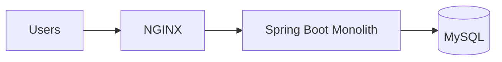
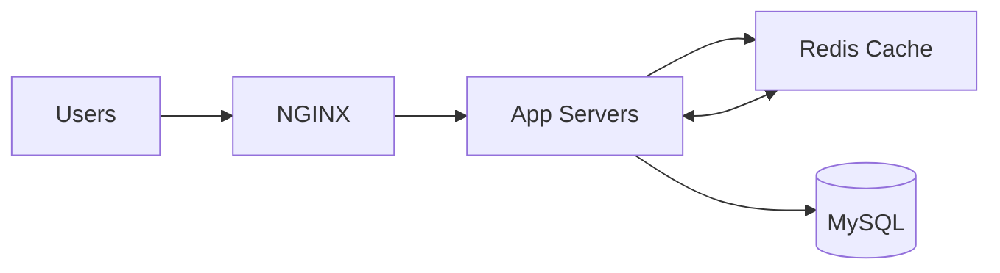
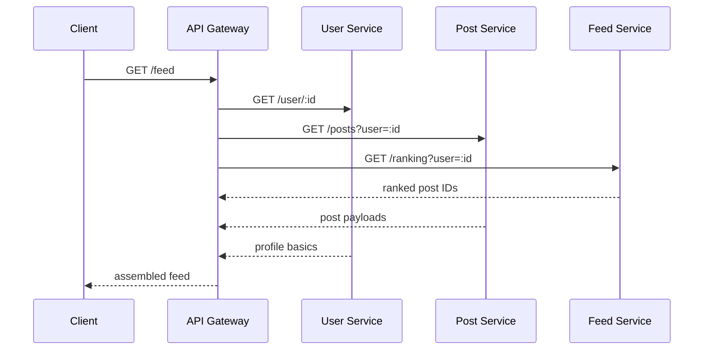
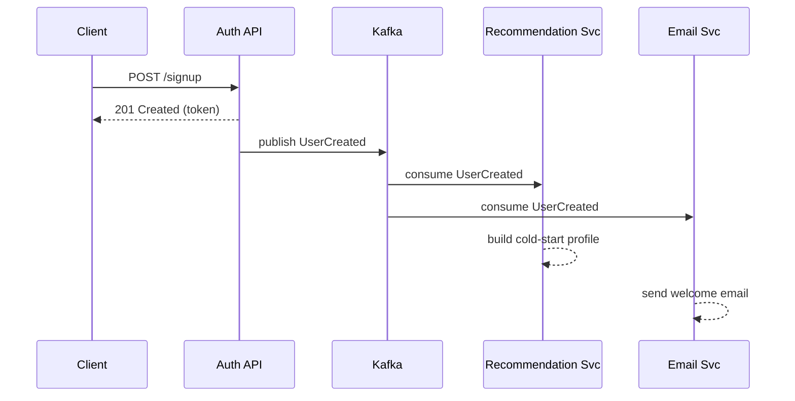
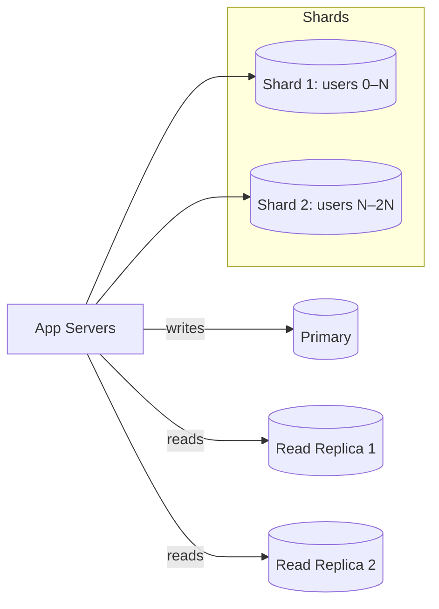

# Scaling to “One Million” Users — What Broke, What We Fixed, and What We’d Do Again

From **100 daily active users (DAU)** to **~1,000,000 users**, this is a no-fluff write‑up of what actually happened in production: the eight phases we went through, the bottlenecks we hit, and the fixes that held under load.

> **TL;DR**
>
> Scaling is the disciplined removal of bottlenecks **at every layer**. Caching, async workflows, database sharding/replication, and real observability are not nice-to-haves; they’re table stakes once you pass early traction.

---

## Quick Stats at ~1M Users (~1k RPS)

- **P95 latency:** 210 ms  
- **Error rate:** \<0.1%  
- **Cache hit ratio:** 85%  
- **Static offload via CDN:** ~70%

---

## Table of Contents

1. [Phase 1 — The Monolith That Worked… Until It Didn’t](#phase-1--the-monolith-that-worked-until-it-didnt)
2. [Phase 2 — More App Servers (But the Bottleneck Stayed)](#phase-2--more-app-servers-but-the-bottleneck-stayed)
3. [Phase 3 — Redis Caching to Cut DB Load](#phase-3--redis-caching-to-cut-db-load)
4. [Phase 4 — Breaking the Monolith into Microservices](#phase-4--breaking-the-monolith-into-microservices)
5. [Phase 5 — Kafka and Async Processing](#phase-5--kafka-and-async-processing)
6. [Phase 6 — Database Scaling: Sharding + Read Replicas](#phase-6--database-scaling-sharding--read-replicas)
7. [Phase 7 — Observability That Prevents Disasters](#phase-7--observability-that-prevents-disasters)
8. [Phase 8 — CDN & Edge Caching](#phase-8--cdn--edge-caching)
9. [Appendix — Practical Notes & Checklists](#appendix--practical-notes--checklists)

---

## Phase 1 — The Monolith That Worked… Until It Didn’t

**Initial stack:** Spring Boot + MySQL + NGINX — all on a single VM.

- Smooth sailing up to **~500 concurrent users**.  
- At **~5k concurrent** we hit the wall:
  - CPU pinned at **100%**
  - **Slow queries** and lock contention
  - **Uptime \< 99%**
  - Dashboards full of **DB locks, GC pauses, thread contention**

**Lesson:** Centralizing everything on one box is fine to prove value, but the first real ceiling is usually **database + JVM GC pressure**, not raw CPU alone.

---

## Phase 2 — More App Servers (But the Bottleneck Stayed)

We added multiple app servers behind NGINX. Reads scaled better, but **every write still hit the same MySQL**.

- Load test results:
  - **1k users → 120 ms**
  - **10k users → 3.2 s**

**Lesson:** Horizontal app scaling can **hide** the bottleneck without fixing it. If writes share a single hot DB, you simply move the queue elsewhere.

---

## Phase 3 — Redis Caching to Cut DB Load

We introduced **Redis** for straightforward caching (hot objects, list pages, session-like reads).

- **DB load reduced ~60%**
- **Cached latency ~20 ms**

**Lesson:** If you want to scale, **caching is not optional**. Start with read-through caching for the hottest keys and invalidate on write.

---

## Phase 4 — Breaking the Monolith into Microservices

We split **User**, **Post**, and **Feed** into separate services with **REST APIs**.

- Good: independent deploys, clearer ownership.
- New problem: **latency chaining** — one external request fans out into multiple internal calls, increasing tail latency.

**Lesson:** Microservices are an **organizational** win, but they **add hops**. Budget for **timeouts, retries, circuit breakers, and bulkheads** from day one.

---

## Phase 5 — Kafka and Async Processing

User **signup** triggered several downstream actions (e.g., recommendations). Initially all **synchronous** → slow and brittle.

We added **Kafka** and moved non‑critical work **async**:

- Signup time dropped from **~1.2 s → ~300 ms**

**Lesson:** Async isn’t a micro‑optimization; at scale it’s a **survival strategy**. Make producers **idempotent** and consumers **retriable**.

---

## Phase 6 — Database Scaling: Sharding + Read Replicas

At **~500k users**, even with caching, **MySQL** was at its limits.

We added:

- **Read replicas** to split reads from writes
- **Sharding** by **user range**
- **Archiving** to push cold data out of hot paths

**Result:** Dramatically reduced **write contention** and **latency**.

**Lesson:** Choose a shard key that:
1) balances load,  
2) keeps high‑affinity data together, and  
3) is easy to route (e.g., **user_id**).

---

## Phase 7 — Observability That Prevents Disasters

Finding a single source of **latency** took **hours** at ~100k users.

We adopted:

- **Jaeger + OpenTelemetry** for **distributed tracing**
- **ELK Stack** for searchable logs
- **Prometheus + Grafana** for SLO‑driven dashboards and alerts

**Outcome:** From **hours** to **minutes** to isolate and fix incidents.

**Lesson:** You can’t fix what you can’t see. Invest in **traces + metrics + logs** before you need them.

---

## Phase 8 — CDN & Edge Caching

At ~1M users, **~40% of traffic** was static assets. We moved these to **Cloudflare CDN**.

- **~70%** origin offload
- JS asset latency from **~400 ms → ~40 ms**

**Lesson:** Put **static + semi‑static** content at the edge. Treat the origin as the **last resort**.

---

## Results at ~1M Users (~1k RPS)

- **P95 latency:** 210 ms  
- **Error rate:** \<0.1%  
- **Cache hit ratio:** 85%

---

## Appendix — Practical Notes & Checklists

### Caching
- Start with a **hot key** inventory (top N objects and list endpoints).
- Prefer **read‑through** with explicit **invalidate-on-write**.
- Set conservative **TTLs**; measure staleness impact before increasing.
- Keep **serialization** cheap; avoid oversized payloads.

### Async & Messaging
- Make **producers idempotent** (e.g., deterministic message keys).
- **At‑least‑once** consumers with **dedupe** on the sink side.
- Keep messages **small**; store large payloads in object storage and reference by ID.
- Define **DLQs** and **replay** procedures.

### Microservices Hygiene
- Standardize **timeouts, retries, and backoff**.
- Protect dependencies with **circuit breakers** and **bulkheads**.
- Centralize **API contracts** (schema/IDL) and automate **compatibility checks**.

### Database Scaling
- Route reads to **replicas**; protect the primary for writes.
- **Shard** on a stable identifier (e.g., `user_id`) and avoid cross‑shard transactions when possible.
- Implement **archival** for cold data to keep hot sets small.

### Observability
- Tag traces with **user_id**, **request_id**, and **shard**.
- Build **golden dashboards**: latency (P50/P95/P99), error rate, saturation (CPU, thread pools, DB connections), cache hit rate.
- Alert on **symptoms** (SLOs), not just **causes**.

### CDN & Edge
- Version static assets (**cache‑busting** via content hash).
- Serve **immutable** assets with long TTLs; mutate by version bump.
- Use **origin shields** and **tiered caching** where available.

---

## The Big Lesson

> **Scaling isn’t “add more servers.”** It’s a ruthless, iterative elimination of bottlenecks across **compute, storage, network, and code paths**.  
> Take **caching**, **async processing**, **sharding/replication**, and **observability** seriously from day zero, and each step to the next order of magnitude gets a lot less painful.

---

*If this post is useful, feel free to reuse with attribution.*  
